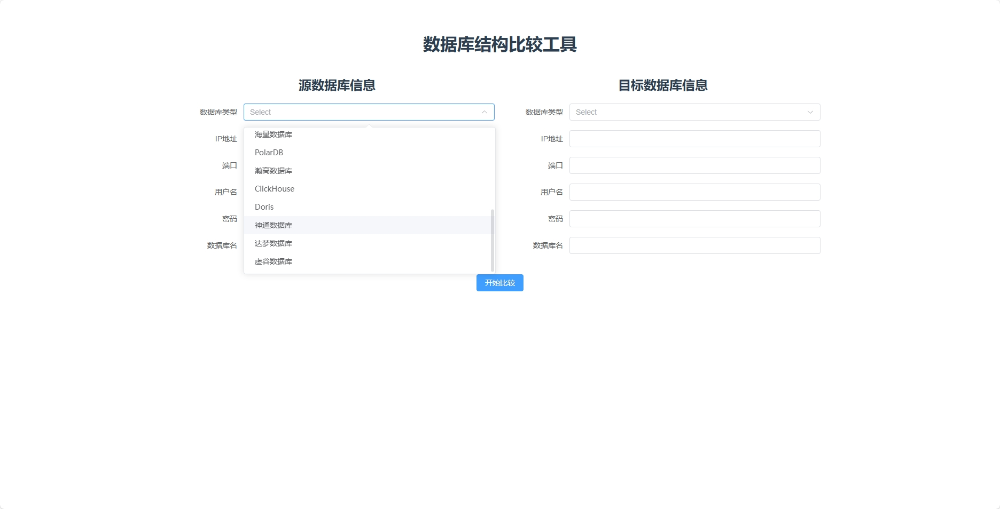

# MigrationsApp
数据库差异比对工具

### 软件功能说明

#### 概述
本软件提供多种数据库的支持，能够帮助用户轻松管理和比较不同数据库之间的结构差异。软件支持的功能包括查看源数据库和目标数据库的字段及表的差异，展示数据库表和字段类型的差异，快速复制单个字段或表的SQL语句，以及复制全部修改的SQL并下载为SQL文件。

#### 支持的数据库
- **MySql**
- **PostgreSQL**
- **SQL Server**
- **Oracle**
- **人大金仓 (Kdbndp)**
- **QuestDB**
- **OpenGauss**
- **南大通用 (GBase)**
- **TiDB**
- **TDengine**
- **海量数据库 (Vastbase)**
- **PolarDB**
- **瀚高数据库 (HG)**
- **ClickHouse**
- **Doris**
- **神通数据库 (Oscar)**
- **达梦数据库 (Dm)**
- **虚谷数据库 (Xugu)**

#### 主要功能

1. **查看源数据库和目标数据库的字段和表的差异**
   - **表差异**：比较源数据库和目标数据库中的表，列出新增、删除和修改的表。
   - **字段差异**：针对每个表，比较源数据库和目标数据库中的字段，列出新增、删除和修改的字段。

2. **展示数据库表和字段类型的差异**
   - **表结构展示**：以表格形式展示源数据库和目标数据库中的表结构，包括表名、字段名、数据类型、长度、是否允许为空等信息。
   - **字段类型对比**：高亮显示字段类型的不同之处，方便用户快速识别差异。

3. **快速复制单个字段或表的SQL**
   - **字段SQL复制**：选择一个字段，生成并复制创建该字段的SQL语句。
   - **表SQL复制**：选择一个表，生成并复制创建该表的完整SQL语句。

4. **复制全部修改的SQL**
   - **生成修改SQL**：根据源数据库和目标数据库的差异，生成所有需要执行的SQL语句，包括表的创建、修改和删除操作。
   - **复制SQL**：将生成的SQL语句复制到剪贴板，方便用户粘贴到数据库管理工具中执行。

5. **下载为SQL文件**
   - **生成SQL文件**：将生成的SQL语句保存为一个SQL文件，支持自定义文件名和保存路径。
   - **下载文件**：点击下载按钮，将SQL文件下载到本地计算机。

#### 使用步骤

1. **连接数据库**
   - 选择需要比较的源数据库和目标数据库。
   - 输入数据库连接信息，包括主机名、端口、用户名、密码和数据库名称。
   - 点击“连接”按钮，建立与数据库的连接。

2. **选择比较对象**
   - 在左侧导航栏中选择需要比较的表或字段。
   - 选择“表差异”或“字段差异”选项卡，查看具体的差异信息。

3. **生成SQL语句**
   - 选择需要生成SQL语句的对象，如单个字段或表。
   - 点击“生成SQL”按钮，生成相应的SQL语句。
   - 复制生成的SQL语句或点击“下载SQL文件”按钮，将SQL语句保存为文件。

4. **执行SQL语句**
   - 将生成的SQL语句粘贴到数据库管理工具中执行。
   - 或者使用下载的SQL文件，在数据库管理工具中执行。

#### 注意事项
- 确保输入的数据库连接信息正确无误，否则无法成功连接到数据库。
- 在生成和执行SQL语句时，建议先在测试环境中进行验证，确保不会对生产数据造成影响。
- 对于大型数据库，生成SQL语句的过程可能需要较长时间，请耐心等待。

新版更新功能描述

我们很高兴地宣布，我们的软件已经完成了重要的更新，加入了全新的功能来提升用户体验。以下是本次更新的主要亮点：

1. SSH代理转发

现在，用户可以通过SSH代理安全地连接到远程数据库。这一功能特别适用于需要从本地环境访问位于防火墙后面的数据库的情况。通过设置useSSH=true并提供相应的SSH服务器信息（如sshHost、sshPort、sshUsername和sshPassword），您可以轻松建立一个加密的通道来确保数据传输的安全性。

2. 命令行方式比对差异

为了满足不同用户的使用需求，新版本还增加了命令行工具的支持，使用户能够以更加灵活的方式执行数据库之间的差异比对。您可以通过以下命令行选项来定制您的任务：

-c <配置文件>: 指定用于比对任务的配置文件路径。

-o <输出文件>: 指定执行结果的输出文件路径。

-h: 显示所有可用的命令行参数帮助信息。

如果没有指定任何命令行参数，则程序将默认启动Web服务模式。

希望本软件能帮助您高效地管理和比较不同数据库的结构差异。如有任何问题或建议，请联系技术支持团队。

